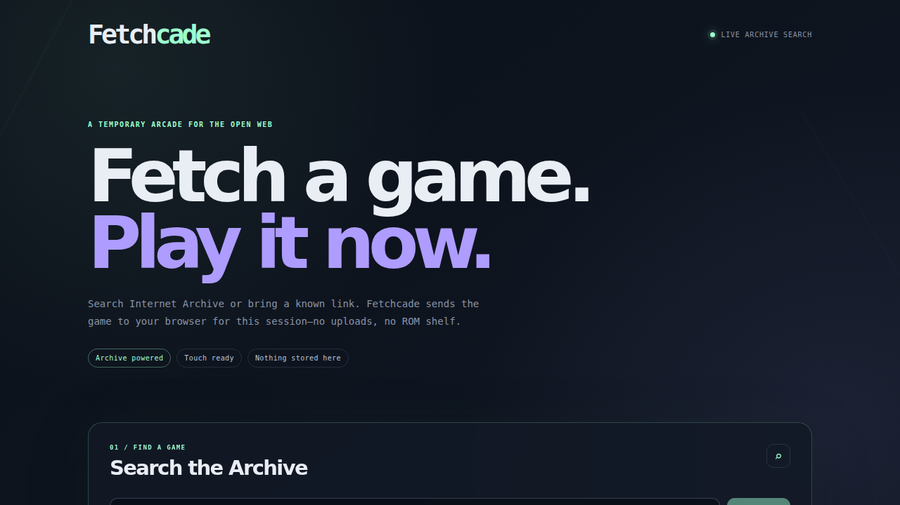
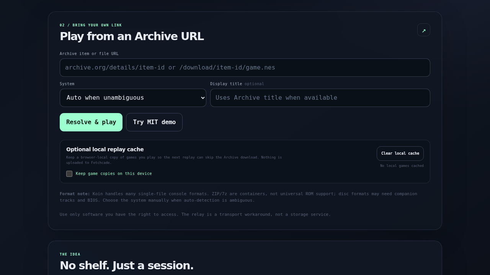
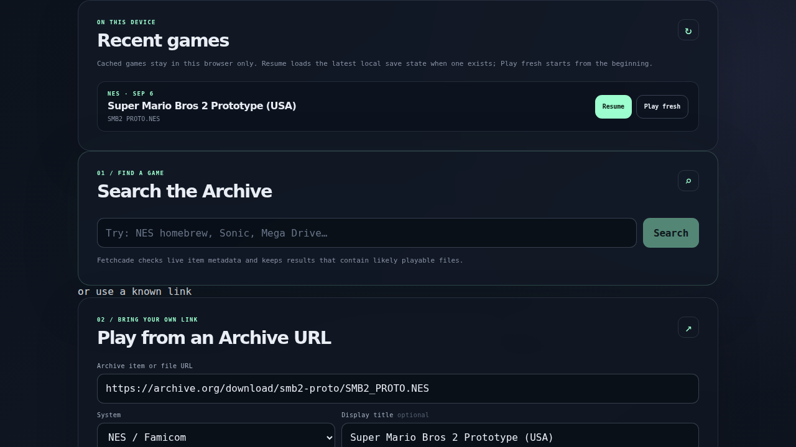
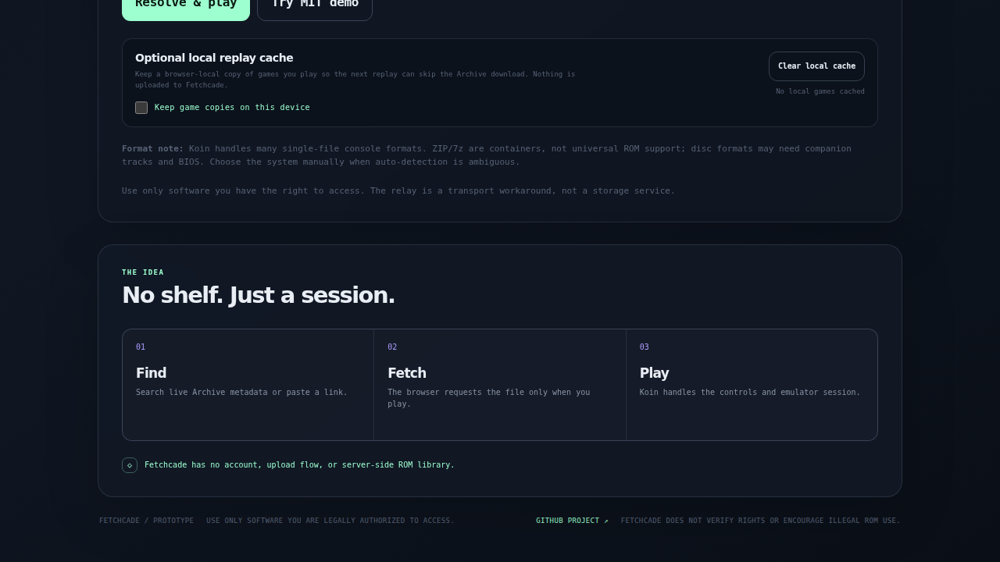

# Fetchcade






**Fetch. Play. No server shelf.**

Fetchcade is a browser-first retro-game launcher. Search Internet Archive, choose an item with a likely playable file, and hand that file to [Koin.js](https://github.com/muditjuneja/koin) for a browser session.

Fetchcade does **not** upload ROMs, maintain a server-side ROM library, or require an account.

## What it includes

- Live Internet Archive search plus direct item/file URL support.
- Metadata inspection so search results are limited to items with likely playable files.
- Koin.js controls and emulator UI, including touch controls, keyboard/gamepad input, rewind, and save-state controls where the selected core supports them.
- An Archive-only Cloudflare Worker relay for download redirects that do not expose browser CORS headers.
- Optional, opt-in browser-local ROM caching for faster replay. It is off by default and can be cleared from the UI.
- A local **Recent games** list of up to 20 cached games. **Play** starts from the beginning; **Resume** loads the latest local save state when one exists.
- Cross-origin isolation and security headers needed by the emulator cores.

## Format expectations

Koin supports many systems, but “supports the extension” does not mean every file from the Internet Archive will boot.

| Kind | Examples | Notes |
| --- | --- | --- |
| Single-file cartridges | `.nes`, `.sfc`, `.smc`, `.n64`, `.z64`, `.gb`, `.gbc`, `.gba`, `.nds`, `.gen`, `.md`, `.sms`, `.gg`, `.pce`, `.a26`, `.a78`, `.ws`, `.wsc`, `.d64`, `.crt` | Best results. Auto-detection works for unambiguous extensions. |
| Arcade packages | `.zip` | Usually an Arcade/FBNeo-style ROM set, not an arbitrary ZIP containing any console ROM. Choose Arcade manually when needed. |
| Compressed/system packages | `.7z` | Core/system dependent and not guaranteed. Choose the system manually. |
| Disc media | `.cue`, `.iso`, `.chd`, `.pbp` | BIOS may be required. A `.cue` commonly needs companion tracks. The current Koin `GamePlayer` API accepts one ROM URL, so multi-file disc sets are not yet a first-class Fetchcade flow. |

Fetchcade intentionally labels ambiguous files instead of pretending that every ZIP, 7z, BIN, or disc image is universally playable.

## Mobile controls

Koin supplies the touch-control UI. On a phone, open Koin's controls/fullscreen affordance after the player loads and consider rotating to landscape. Exact fullscreen behavior depends on the browser and device. The MIT demo button is a quick way to test controls independently of Archive metadata.

## Storage and lifecycle

There are two separate storage concepts:

1. **Session memory:** Koin/Nostalgist downloads the selected file into browser memory while the emulator is running. Choosing **Stop session** unmounts the player; Koin's cleanup path stops the emulator and releases its temporary emulator resources.
2. **Optional local replay cache:** When enabled, Koin stores a copy in this browser's Cache Storage under the Koin ROM cache. This is persistent client-side storage, not server-side storage. It is disabled by default. The **Clear local cache** button removes those local copies; it does not delete anything from Internet Archive or Fetchcade servers.

Closing a session does not delete an intentionally enabled local cache. Stop the session before clearing it.

Koin's player preferences are also browser-local and persistent for the same origin: volume, mute, shader/haptics preferences, keyboard mappings by system, and gamepad mappings by player. They do not sync between devices and can be removed by clearing site data or using private browsing. With local caching disabled, Koin's Save/Load controls use downloadable `.state` files. With local caching enabled, Fetchcade wires Save/Load and Koin's auto-save to one browser-local resume state per game. When the optional cache is enabled, Fetchcade supplies a stable per-game ID so Koin's game-keyed preferences such as cheats can be associated with that game.

When local caching is enabled, Fetchcade also keeps up to 20 cached game entries in browser-local metadata. **Resume** uses the most recent local save state created by Koin's auto-save, visibility-save, or Save control. It is not a server sync service and it cannot resume a game whose local ROM/cache was cleared.

## Run locally

```bash
npm install
npm test
npm run dev
```

Open the Vite URL shown in the terminal. For the Worker relay and production headers, generate a local Wrangler config and run the built app:

```bash
npm run build
export FETCHCADE_WORKER_NAME=my-fetchcade-local
export FETCHCADE_CUSTOM_DOMAIN=
npm run generate-wrangler-config
npx wrangler dev --config .wrangler.generated.json
```

The generated config is ignored by Git. Do not commit tokens, account IDs, or generated infrastructure configuration.

## Deploy to Cloudflare Workers

The repository deliberately keeps the Worker name, custom domain, account ID, and credentials out of tracked files. See [`docs/CLOUDFLARE.md`](docs/CLOUDFLARE.md).

For a manual deploy, set deployment-only environment variables in your shell:

```bash
export CLOUDFLARE_API_TOKEN='your-token-in-the-shell-or-secret-manager'
export CLOUDFLARE_ACCOUNT_ID='your-account-id'
export FETCHCADE_WORKER_NAME='your-worker-name'
export FETCHCADE_CUSTOM_DOMAIN='play.example.com'
npm run deploy
```

Never commit the values. `FETCHCADE_CUSTOM_DOMAIN` may be left empty when using only a `workers.dev` hostname.

## Legal / responsible use

Fetchcade is a transport and browser-playback tool. It is not a license to download, possess, or play copyrighted software. Internet Archive search results can include material with different rights status. Use only software you own, created, licensed, or are otherwise legally authorized to access, and follow the applicable Internet Archive and local laws. Fetchcade does not encourage copyright infringement and does not verify the legal status of search results.

See [`docs/LEGAL.md`](docs/LEGAL.md), [`NOTICE`](NOTICE), and [`LICENSE`](LICENSE).

## Project layout

```text
src/                 React UI and Archive parsing/search logic
src/cache.mjs         Opt-in browser-local ROM cache helpers
worker/index.js      Cloudflare Worker relay and health endpoint
public/_headers      COOP/COEP and security headers
scripts/             Koin patch and generated Wrangler config helper
docs/                Deployment, legal, and screenshot documentation
```

## License

Fetchcade's original code is MIT licensed. Third-party software and the MIT-licensed demo ROM are attributed in [`NOTICE`](NOTICE).